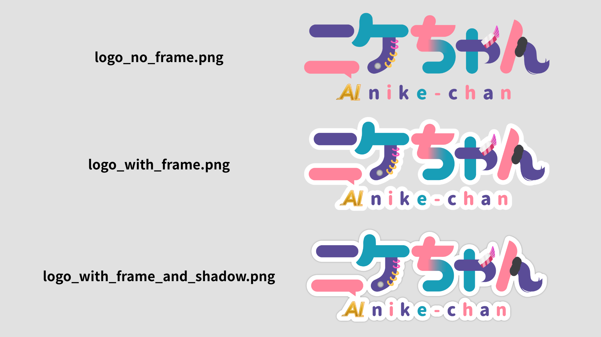

# AIニケちゃん 公式ロゴ

このフォルダでは、AIニケちゃんの公式ロゴ画像を配布しています。利用前に、このREADMEと次のガイドラインを必ずご確認ください。

- [二次創作ガイドライン](../guidelines/derivative_creation_guideline.md)
- [AI生成ガイドライン](../guidelines/ai_generation_guideline.md)
- [公式サイトの詳細版ガイドライン（一般条件の正本）](https://nikechan.com/guidelines/derivative)

## ファイル一覧

- `logo_no_frame.png` - フレームなし
- `logo_with_frame.png` - 白フレーム付き
- `logo_with_frame_and_shadow.png` - 白フレーム・影付き

## 利用条件の要点

- 原則として非営利利用に限ります。法人利用はできません。
- 公式・監修・公認と誤解させる表示や、なりすましには利用できません。
- 政治・宗教的主張、誹謗中傷、公序良俗に反する表現、第三者の権利侵害などには利用できません。
- 二次創作の物理グッズや印刷物については、現行ガイドラインでロゴ使用が禁止されています。
- 二次創作作品を配布する場合は、「AIニケちゃんの非公式ファンメイド作品」である旨を作品と配布ページに明記してください。

詳細な収益条件、成人向け表現、配布条件、禁止事項は[二次創作ガイドライン](../guidelines/derivative_creation_guideline.md)が優先されます。

## 生成AIでの利用

このフォルダのロゴ画像は、AI生成ガイドラインで生成AIへの入力・参照・学習・変換が認められた公式素材です。生成物、学習済みモデル、LoRA、Embedding、ワークフロー、データセット等を公開・配布する場合も、両ガイドラインの非営利・表記・配布条件に従ってください。

## 直接利用・改変・再配布

- 公式ロゴは、非営利のSNS投稿、アイコン、ヘッダー、サムネイル、動画内表示等に直接利用できます。
- 公式・監修・公認と誤解される見せ方には利用できません。
- 色、縦横比、文字、構成要素等の改変条件は現行ガイドラインに明記されていないため、改変前に作者へお問い合わせください。
- 公式ロゴ画像の原本・改変版の再配布は禁止です。
- ゲーム、アプリ、素材集等へ公式ロゴ画像のデータそのものを同梱することもできません。

法人・団体による利用や、ガイドラインに記載のない商用・収益目的の利用はできません。

## 表記例

配布する二次創作作品や配布ページでは、次のように記載してください。

> 本作品はAIニケちゃんの非公式ファンメイド作品です。原作・公式とは関係ありません。

## 問い合わせ

- 作者X: [@tegnike](https://x.com/tegnike)
- Discord DM: [AIニケちゃん公式Discord](https://discord.com/invite/G4E5Sf3yj3)内で作者へDM
