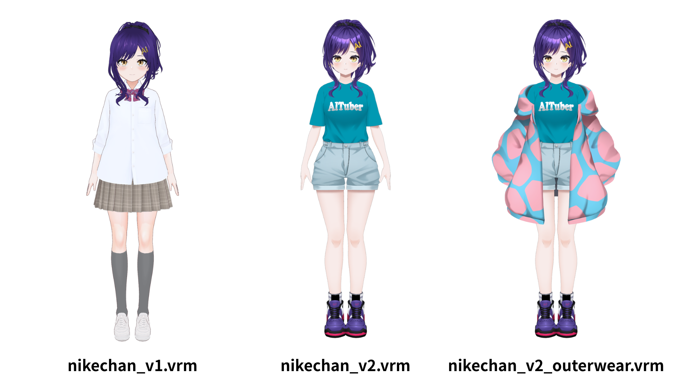

# AIニケちゃん VRMモデル・Blenderデータ

このフォルダでは、AIニケちゃんの公式VRMモデルとBlenderデータを配布しています。利用前に、このREADMEと次のガイドラインを必ずご確認ください。

このフォルダで公開するBlenderデータ（`.blend`）には、今後追加するものも含め、本READMEの利用条件が適用されます。

- [二次創作ガイドライン](../guidelines/derivative_creation_guideline.md)
- [AI生成ガイドライン](../guidelines/ai_generation_guideline.md)
- [公式サイトの詳細版ガイドライン（一般条件の正本）](https://nikechan.com/guidelines/derivative)

## ファイル一覧

- `nikechan_v1.vrm` - 初期バージョン
- `nikechan_v2.vrm` - 改良版
- `nikechan_v2_outerwear.vrm` - アウター着用版
- `ニケちゃん.blend` - 採用済み最新版V37顔修正版のBlender原本。上着あり・なしの両モデルを編集できます。

## Blender原本について

`ニケちゃん.blend` は、現在配布中のVRMに対応する採用済み最新版V37顔修正版（v37_Face）の原本です（154,003,328 bytes）。原本の内容は変更せず、配布用のファイル名に統一しています。Git LFSで管理しているため、Gitで取得する場合はGit LFSを導入して `git lfs pull` を実行してください。

SHA-256: `e6638c362f3ef463d5ea74bd85f88bb255067b464310e3ee982cfcdcb87228e1`

## 利用条件の要点

- このモデルを用いた二次創作は、二次創作ガイドラインの範囲で利用できます。
- 原則として非営利利用に限ります。法人利用はできません。
- SNS・動画配信では、ガイドライン所定の表記・申告条件を満たす場合に限り、広告・投げ銭・メンバーシップ等のプラットフォーム標準収益機能を利用できます。
- スポンサー契約、タイアップ、アフィリエイト、物販・予約リンク等の外部商業導線には利用できません。
- 公式・監修・公認と誤解させる表現、なりすまし、政治・宗教的主張、誹謗中傷、第三者の権利侵害などは禁止です。
- 配布する作品や配布ページには、「AIニケちゃんの非公式ファンメイド作品」である旨を明記してください。SNSの単発投稿では任意です。

詳細な収益条件、成人向け表現、配布条件、禁止事項は[二次創作ガイドライン](../guidelines/derivative_creation_guideline.md)が優先されます。

## 生成AIでの利用

このフォルダのVRMモデル3種は、AI生成ガイドラインで生成AIへの入力・参照・学習・変換が認められた公式素材です。生成物、学習済みモデル、LoRA、Embedding、ワークフロー、データセット等を公開・配布する場合も、両ガイドラインの非営利・表記・配布条件に従ってください。

他者が制作した二次創作物を生成AIに利用する場合は、その作者の明示的な許諾が別途必要です。

Blenderデータの公開は、生成AIへの利用許可を追加するものではありません。Blenderデータやそこから取り出した素材・書き出したデータの生成AIへの入力・参照・学習・変換は、AI生成ガイドラインで明示的に許可された範囲に限ります。

## Blenderデータ（`.blend`）の利用

本項は、このフォルダで公式に配布するBlenderデータと、それに含まれるメッシュ、テクスチャ、マテリアル、リグ、アニメーション等に適用します。

- 二次創作ガイドラインの範囲で、Blender上での編集・改変、ポーズ付け、アニメーション制作、画像・動画のレンダリングに利用できます。
- 自分で利用するために、改変したデータを保存したり、VRM・FBX・glTF等の形式へ書き出したりできます。書き出したデータにも同じ利用条件が適用されます。
- レンダリングした画像・動画は、二次創作ガイドラインの非営利・収益化・表記等の条件に従って公開できます。
- `.blend`の原本・改変版、別形式に変換したモデル、取り出したメッシュ・テクスチャ等の公式素材は再配布できません。無料配布や、ゲーム・アプリ・素材集等への同梱も含みます。
- 公式データを編集・変換・抽出しただけの素材は、「利用者が新規に制作した二次創作素材」として配布できません。
- 第三者の素材を追加する場合は、その素材の利用条件にも従ってください。

## 再配布について

次の行為は禁止です。

- 配布中の公式VRMファイルそのものの再配布
- 改変したVRMファイル自体の配布
- ゲーム、アプリ、素材集等への公式VRMファイルの同梱
- 公式Blenderデータの原本・改変版・変換版や、取り出した公式素材の再配布・同梱

VRM・Blenderデータからレンダリングした画像・動画や、利用者が新規に制作した二次創作物は、ガイドラインの条件に従って公開・配布できます。

法人・団体による利用や、ガイドラインに記載のない商用・収益目的の利用はできません。

## VRMファイル内の利用条件表示について

VRMファイル内に埋め込まれているライセンス・利用条件に関するメタデータは、過去の設定であり適用されません。内容は無視してください。

このVRMモデルの利用には、公式サイトの詳細版ガイドラインと、このREADMEに記載されたアセット固有の条件を適用します。

## 表記例

配布する作品や配布ページでは、次のように記載してください。

> 本作品はAIニケちゃんの非公式ファンメイド作品です。原作・公式とは関係ありません。

クレジットは必須ではありません。任意で記載する場合の例です。

> クレジット: ニケ（@tegnike）／AIニケちゃん

## 問い合わせ

- 作者X: [@tegnike](https://x.com/tegnike)
- Discord DM: [AIニケちゃん公式Discord](https://discord.com/invite/G4E5Sf3yj3)内で作者へDM
